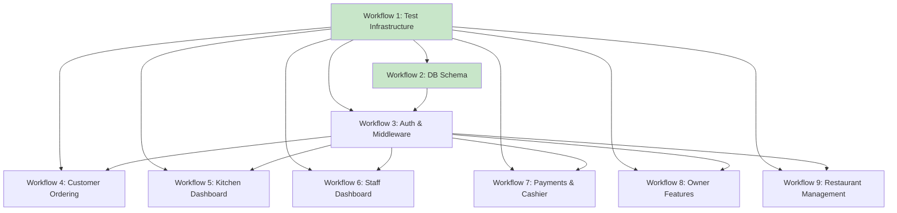

# Workflow Index

This document tracks all implementation workflows for the Restaurant QR Order System.

## Workflows

| # | Workflow | Status | Description |
|---|----------|--------|-------------|
| 1 | [Test Infrastructure](workflows/plan-1.md) | ✅ Done | Jest, Playwright, RLS test harness |
| 2 | [DB Schema Verification & Storage](workflows/plan-2.md) | ✅ Done | Schema verification, RLS tests, storage buckets, QR generation |

## Workflow Relationships

## Dependency Chain

All workflows depend on **Workflow 1 (Test Infrastructure)** being complete first, as it provides the testing harness required by later workflows. **Workflow 2 (DB Schema)** must complete before any feature workflow that touches database tables.

## Status Summary

- **Completed:** Workflows 1–2 (test infrastructure, schema verification)
- **Pending:** Workflows 3–9 (auth, features, dashboards)
