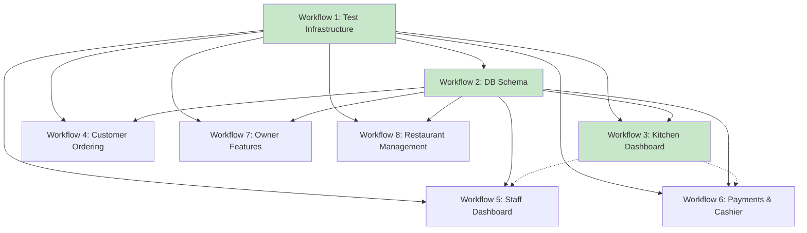

# Workflow Index

This document tracks all implementation workflows for the Restaurant QR Order System.

## Workflows

| # | Workflow | Status | Description |
|---|----------|--------|-------------|
| 1 | [Test Infrastructure](workflows/plan-1.md) | ✅ Done | Jest, Playwright, RLS test harness |
| 2 | [DB Schema Verification & Storage](workflows/plan-2.md) | ✅ Done | Schema verification, RLS tests, storage buckets, QR generation |
| 3 | [Kitchen Dashboard](workflows/plan-3.md) | ✅ Done | API route handler, order service, polling hook, dark theme |

## Workflow Relationships

## Dependency Chain

All workflows depend on **Workflow 1 (Test Infrastructure)** being complete first, as it provides the testing harness required by later workflows. **Workflow 2 (DB Schema)** must complete before any feature workflow that touches database tables. **Workflow 3 (Kitchen Dashboard)** establishes patterns (API routes, services) reused by later dashboards.

## Status Summary

- **Completed:** Workflows 1–3 (test infrastructure, schema verification, kitchen dashboard)
- **Pending:** Workflows 4–8 (customer ordering, staff, payments, owner, management)
