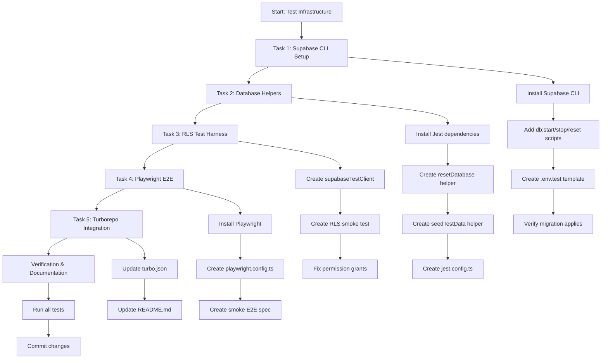
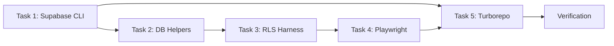
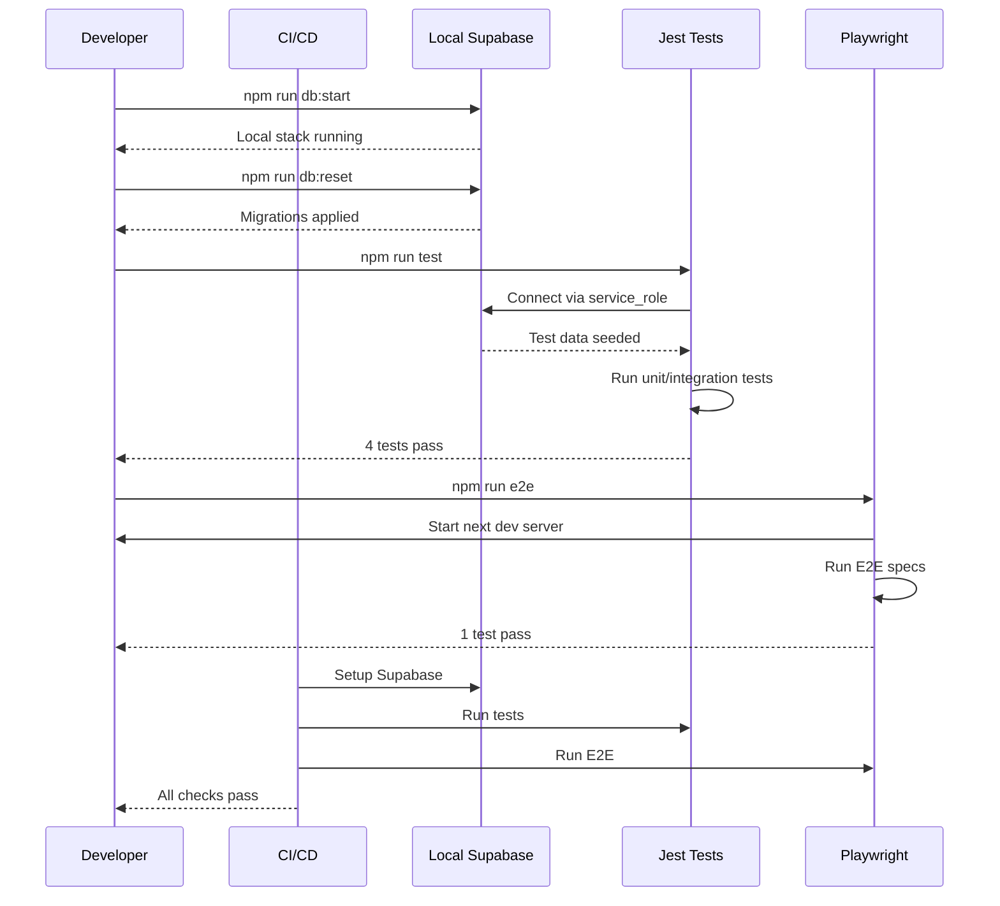
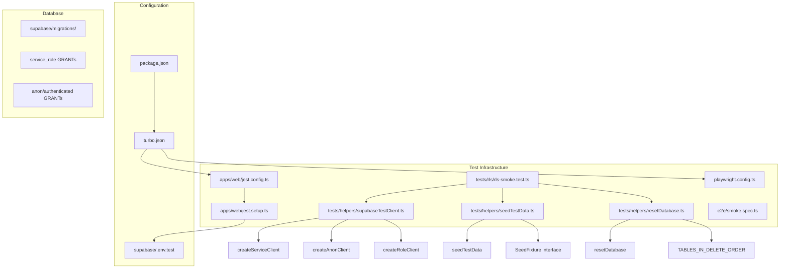
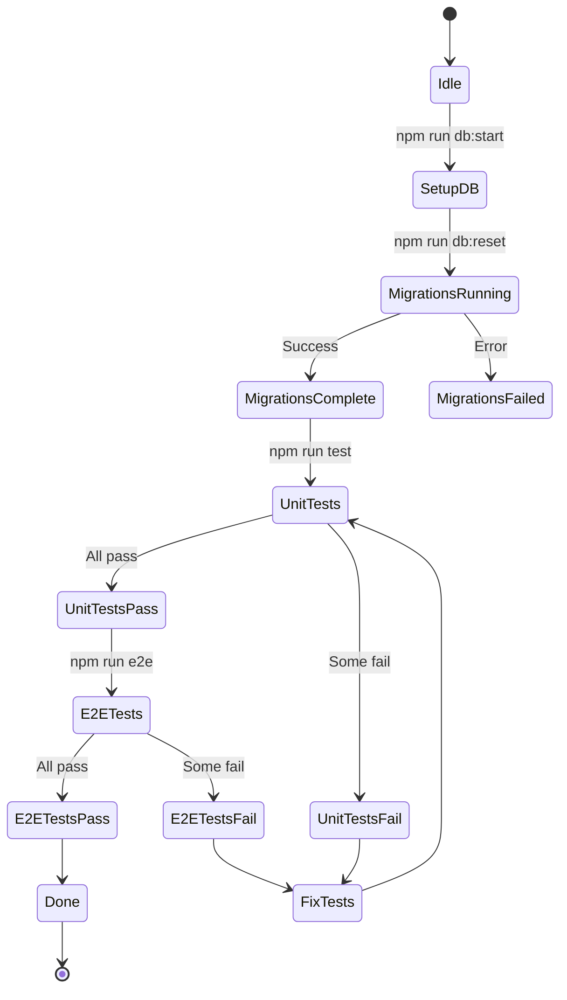

# Workflow: Test Infrastructure Implementation

## Overview

This workflow documents the implementation of the test infrastructure for the Restaurant QR Order System. It covers Jest unit/integration testing, RLS policy verification, and Playwright E2E testing.

## Workflow Diagram

## Task Dependencies

## Test Execution Flow

## File Structure

## State Machine: Test Lifecycle

## Decision Log

| Decision | Rationale |
|----------|-----------|
| Jest for unit/integration | Industry standard, good TypeScript support via ts-jest |
| Playwright for E2E | Cross-browser, built-in assertions, excellent DX |
| Service-role for test setup | Bypasses RLS for fixture creation |
| Separate .env.test | Isolates test config from dev config |
| FK-order table deletion | Prevents constraint violations during reset |
| Grant statements for roles | Required for Supabase RLS to function properly |

## Success Criteria

- [x] `npm run db:start` starts local Supabase
- [x] `npm run db:reset` applies all migrations
- [x] `npm run test` passes (4 tests)
- [x] `npm run e2e` passes (1 test)
- [x] Test helpers exported with correct signatures
- [x] Documentation updated

## Related Documents

- [Test Infrastructure Plan](../superpowers/plans/2026-07-08-test-infrastructure.md)
- [CLAUDE.md](../../CLAUDE.md)
- [Feature Spec](../../feature-spec.md)
