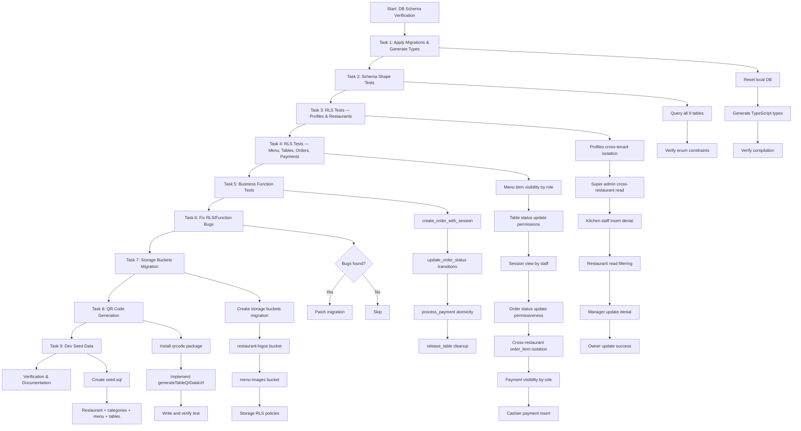
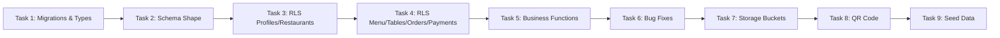
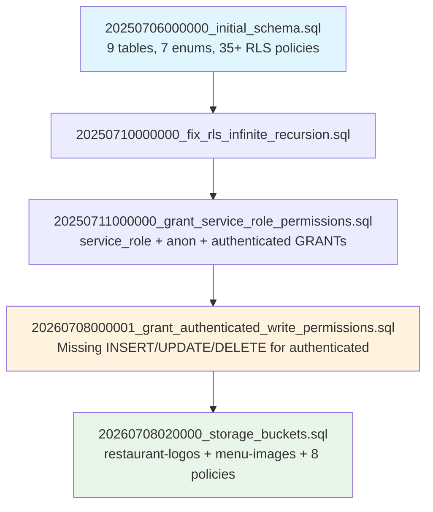
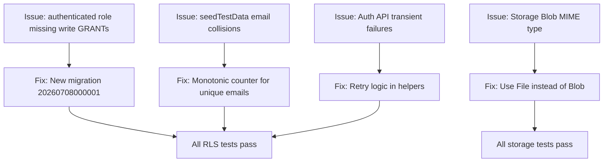
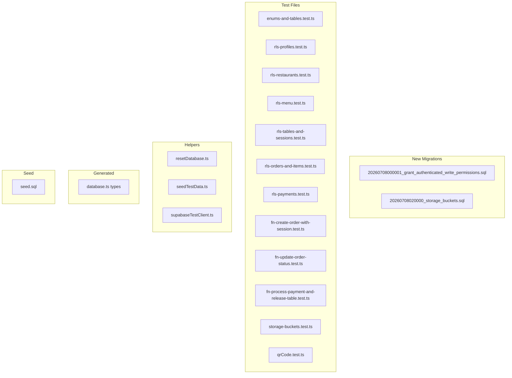

# Workflow: Database Schema Verification & Storage Setup

## Overview

This workflow documents the verification of the existing database schema against `feature-spec.md` and `tech-stack.md`, addition of storage buckets, real QR code generation, and comprehensive RLS/business-function test coverage.

## Status: ✅ Complete

## Workflow Diagram

## Task Dependencies

## Migration Chain

## Test Coverage Matrix

```mermaid
graph TD
    subgraph "Schema Shape (10 tests)"
        S1[9 table queryable probes]
        S2[1 enum rejection test]
    end

    subgraph "RLS Policies (16 tests)"
        R1[profiles: 3 tests]
        R2[restaurants: 3 tests]
        R3[menu: 3 tests]
        R4[tables/sessions: 3 tests]
        R5[orders/items: 2 tests]
        R6[payments: 2 tests]
    end

    subgraph "Business Functions (10 tests)"
        B1[create_order_with_session: 3]
        B2[update_order_status: 4]
        B3[process_payment: 2]
        B4[release_table: 1]
    end

    subgraph "Storage (4 tests)"
        ST1[bucket existence]
        ST2[owner upload]
        ST3[waiter upload denial]
        ST4[public read]
    end

    subgraph "QR Code (1 test)"
        Q1[generateTableQrDataUrl]
    end

    S1 --> TOTAL[Total: 41 tests]
    S2 --> TOTAL
    R1 --> TOTAL
    R2 --> TOTAL
    R3 --> TOTAL
    R4 --> TOTAL
    R5 --> TOTAL
    R6 --> TOTAL
    B1 --> TOTAL
    B2 --> TOTAL
    B3 --> TOTAL
    B4 --> TOTAL
    ST1 --> TOTAL
    ST2 --> TOTAL
    ST3 --> TOTAL
    ST4 --> TOTAL
    Q1 --> TOTAL
```

## Issues Found & Fixed

## File Structure

## Decision Log

| Decision | Rationale |
|----------|-----------|
| New migration for grants | Never edit applied migrations (CLAUDE.md rule) |
| Unique emails per seed call | Prevents cross-restaurant profile leakage in tests |
| Retry logic for auth API | Local Supabase returns transient 500s under load |
| `--runInBand` for test execution | Avoids auth API rate limiting from parallel tests |
| `import * as QRCode` | `@types/qrcode` has no default export |
| `File` over `Blob` for storage | Supabase storage rejects `application/octet-stream` |
| Monotonic counter in seedTestData | Ensures unique fixtures per `seedTestData()` call |

## Success Criteria

- [x] `npm run db:reset` applies all 5 migrations + seed data
- [x] `packages/shared/src/types/database.ts` exists and compiles
- [x] 41 tests pass: 10 schema + 16 RLS + 10 business functions + 4 storage + 1 QR
- [x] `generateTableQrDataUrl` works and is tested
- [x] Every RLS policy and business function has at least one test

## Related Documents

- [DB Schema Plan](../superpowers/plans/2026-07-08-db-schema.md)
- [Test Infrastructure Plan](../superpowers/plans/2026-07-08-test-infrastructure.md)
- [CLAUDE.md](../../CLAUDE.md)
