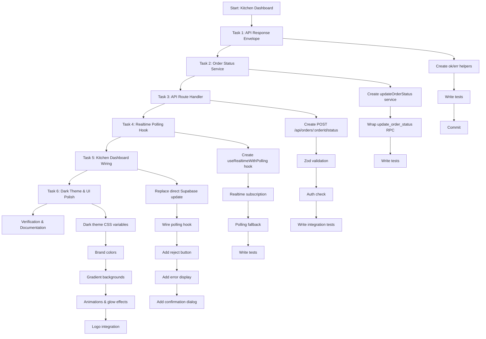
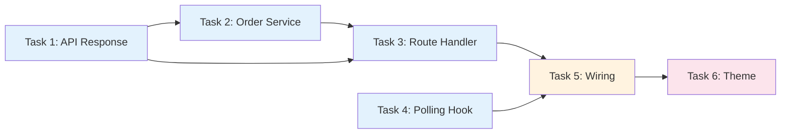
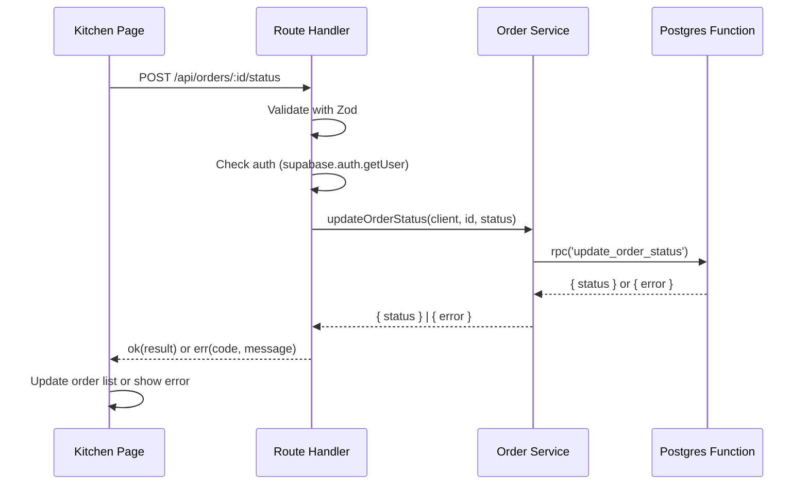
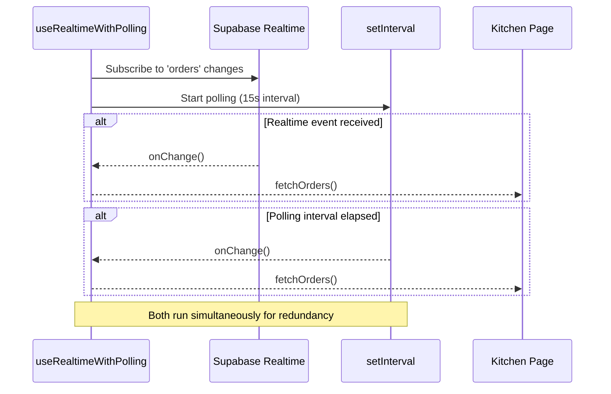
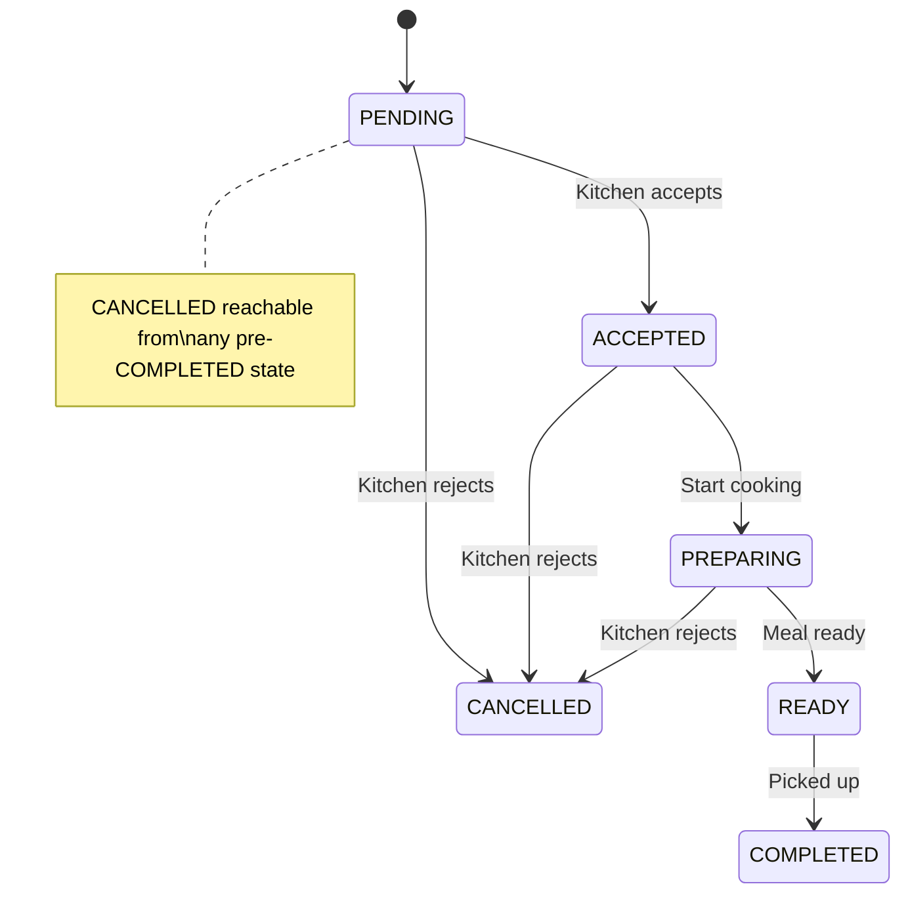

# Workflow: Kitchen Dashboard Implementation

## Overview

This workflow documents the implementation of the Kitchen Dashboard feature. It establishes the API route handler pattern, adds the order status service, Realtime polling fallback hook, and wires the kitchen UI with proper error handling and reject action.

## Status: ✅ Complete

## Workflow Diagram



## Task Dependencies



## Architecture Pattern



## Realtime + Polling Pattern



## File Structure

```mermaid
graph TD
    subgraph "New Files"
        A[packages/shared/src/http/apiResponse.ts]
        B[apps/web/lib/services/orderStatusService.ts]
        C[apps/web/app/api/orders/[orderId]/status/route.ts]
        D[apps/web/hooks/useRealtimeWithPolling.ts]
    end

    subgraph "Modified Files"
        E[apps/web/app/(kitchen)/kitchen/page.tsx]
        F[apps/web/app/(auth)/login/page.tsx]
        G[apps/web/app/globals.css]
        H[apps/web/tailwind.config.ts]
    end

    subgraph "Test Files"
        I[tests/http/apiResponse.test.ts]
        J[tests/services/orderStatusService.test.ts]
        K[tests/api/orders-status-route.test.ts]
        L[tests/hooks/useRealtimeWithPolling.test.tsx]
    end

    A --> I
    B --> J
    C --> K
    D --> L

    A --> C
    B --> C
    C --> E
    D --> E

    G --> E
    G --> F
    H --> E
    H --> F
```

## State Machine: Order Status



## Decision Log

| Decision | Rationale |
|----------|-----------|
| ok()/err() envelope | Consistent response shape for all route handlers |
| Service wraps RPC | Single place for update_order_status call, reusable by staff dashboard |
| Polling alongside Realtime | Redundancy for dropped connections, harmless double-fetch |
| onChange excluded from deps | Prevents channel re-subscription on every render |
| Confirmation dialog for reject | Prevent accidental order cancellation |
| Dark theme with gradients | Brand identity, modern aesthetic, reduces eye strain |

## Success Criteria

- [x] Kitchen dashboard routes all status changes through API
- [x] ok()/err() envelope used by route handler
- [x] Reject order action with confirmation dialog
- [x] Polling fallback for Realtime connection drops
- [x] Errors displayed to user (not silently swallowed)
- [x] Tests pass: 4 apiResponse + 2 orderStatus + 3 route + 1 polling = 10 tests
- [x] useRealtimeWithPolling and orderStatusService have correct signatures for reuse
- [x] Dark theme with brand colors applied

## Related Documents

- [Kitchen Dashboard Plan](../superpowers/plans/2026-07-09-kitchen-dashboard.md)
- [Test Infrastructure](plan-1.md)
- [DB Schema Verification](plan-2.md)
- [CLAUDE.md](../../CLAUDE.md)
- [Feature Spec](../../feature-spec.md)
